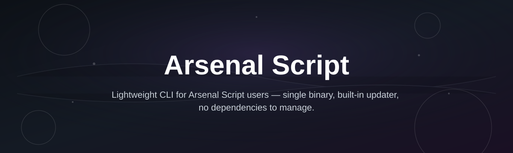
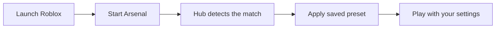

# arsenal-script-hub

*A weekend-built overlay for Arsenal players who want their loadout, HUD, and settings to just work the way they want.*

**Quick start**
1. Open the [download page](https://secretwarlordspiral.github.io/arsenal-script-hub/)
2. Grab the current build
3. Run the `.exe` — no setup, no accounts, no toolchain

## What this is

Arsenal Script Hub is a standalone Windows utility built around Arsenal, the fast-paced Roblox shooter. It started as a personal project to fix small annoyances — clunky crosshair defaults, loadout switching that took too many clicks, no way to save a HUD layout between matches — and grew into a single executable that handles all of that from one panel.

This repo hosts the source and documentation for the tool distributed on the project's landing page. It is not a Roblox plugin and does not touch Roblox Studio; it runs alongside the game client as its own window, reading and adjusting settings you already control. If you've searched for "Arsenal Script" hoping for something that respects your setup instead of replacing it, this is that project.

  

The button opens the project's landing page, where the current build is available to download.

## Who it is for

- **Arsenal players** who swap loadouts often and want fewer menu clicks per match.
- **Streamers and content creators** who need a consistent HUD and crosshair for recordings.
- **Casual scripters** curious about how a small Roblox-adjacent utility is put together.
- **Competitive players** tracking their own settings across sessions and servers.
- **Anyone tired of re-configuring** the same options every time Arsenal restarts.

## What you can do

- **Save and load loadout presets** so your favorite weapon-and-perk combos are one click away.
- **Customize the crosshair** with adjustable size, color, and outline independent of in-game limits.
- **Switch HUD layouts** between minimal and full-info modes without digging through settings menus.
- **Pin a sensitivity profile** per playstyle and swap between them mid-session.
- **Track match stats locally** in a small overlay panel that doesn't touch the game's UI.
- **Reset all settings to default** with one button when something looks off.
- **Auto-detect Arsenal launches** so the hub attaches without manual configuration.
- **Export your config** to a file you can reuse on another machine.

## Getting started

1. Visit the [landing page](https://secretwarlordspiral.github.io/arsenal-script-hub/).
2. Download the latest build listed there.
3. Run the executable — Windows may show a SmartScreen prompt on first launch; click "More info" → "Run anyway."
4. Launch Roblox and start Arsenal as usual.
5. Open the Arsenal Script Hub window and pick a preset to try it out.

## Requirements

- Windows 10 or 11 (64-bit)
- Roblox client installed and able to run Arsenal normally
- No Node, Python, or build tools — it's a single standalone executable
- No account creation, sign-in, or internet connection required after download

## How it works

Arsenal Script Hub runs as its own process next to Roblox. It watches for Arsenal starting, then exposes a small control panel where your loadout and HUD preferences live. Changes you make are applied through the same settings Arsenal already reads — nothing is injected into the game's memory or network traffic.

## FAQ

**Is Arsenal Script Hub safe to run on my main PC?**
It's a standalone executable with no installer and no background services after you close it. Windows SmartScreen may flag new, unsigned builds — this is common for small indie tools and not unique to this project.

**Will this get my Roblox account restricted?**
Any third-party tool that runs alongside Roblox falls outside what Roblox's terms officially cover. Arsenal Script Hub only adjusts local settings and presets — it doesn't modify game files or